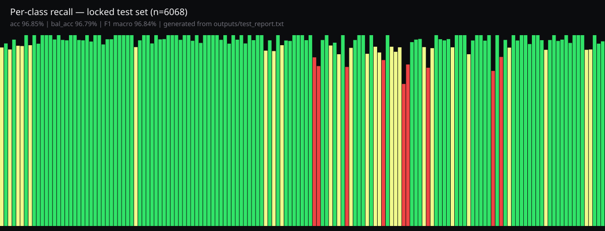

# PokT Pokedex — Gen 1 Scanner

## Tech stack


Point a camera at a Pokemon and get a full Pokedex entry: classification, official artwork gallery, cry, lore, base stats, abilities, type weaknesses, and evolution chain. Covers **149 Gen 1 classes** with a **70% confidence gate** — low-confidence shots are rejected instead of guessing.

Live demo: **https://pokt-web.onrender.com** · API: **https://pokt-backend.onrender.com** (`/health`, `/docs`)

## How it works

```
Camera / Gallery  →  Expo app  →  POST /predict  →  ONNX classifier (ResNet-18, 224px)
                                →  GET /pokemon/{name}  →  PokeAPI (+ offline fallback)
                                →  POST /ocr  →  RapidOCR card reader (name / HP / card no.)
```

- **Classifier** — ONNX model (`outputs/best.onnx`), ImageNet normalization, center-crop preprocess. Rejects anything under 70% confidence.
- **Card OCR** — RapidOCR reads TCG cards and cross-checks the printed name against the classifier (`agree: true/false`).
- **Dex data** — types, stats, abilities, flavor text, artwork gallery, cries, and full branching evolution chains (Gen 1 only, Eevee keeps all three evolutions) from PokeAPI, cached server-side.
- **App UX** — boot self-test, scan reveal animation, narrated entries, rescannable gallery, persistent seen-dex (0–151), works on Android (EAS APK) and web.


## Test results

Locked test set, evaluated once (`src/eval.py` → `outputs/test_report.txt`):

| Metric | Score |
| --- | --- |
| Accuracy (n=6068) | **96.85%** |
| Balanced accuracy | 96.79% |
| Macro F1 | 96.84% |



Worst classes are all above 0.92 recall (Weepinbell 0.923, Weezing/Alakazam 0.925) — comfortably above the 70% in-app confidence gate, so production rejects are rare and genuine.

## Repo layout

| Path | What |
| --- | --- |
| `app/` | Expo 57 (React Native + Web) frontend |
| `backend/server.py` | FastAPI: `/predict` `/pokemon/{name}` `/ocr` `/scan` `/health` |
| `backend/Dockerfile` + `requirements-server.txt` | Lean runtime image (no training stack) |
| `src/` | Training pipeline: fetch → train → eval → export ONNX |
| `outputs/best.onnx` + `classes.txt` | Shipped model + labels (large experiment files stay local, see `.gitignore`) |
| `render.yaml` | Blueprint: `pokt-backend` (Docker) + `pokt-web` (static Expo export) |

## Run it locally

**Backend** (needs `outputs/best.onnx` + `classes.txt`):

```bash
pip install -r backend/requirements-server.txt
uvicorn backend.server:app --app-dir . --port 8000
# → http://localhost:8000/docs
```

**App** (point `app/lib/api.ts` → `DEFAULT_BASE_URL` at your backend):

```bash
cd app && npm ci && npx expo start        # phone via Expo Go
npx expo start --web --port 8081          # browser demo
npx expo export --platform web            # static build → app/dist
```

**Android APK**: `eas build -p android --profile preview` (see `app/eas.json`).

## Deploy (all free tier)

1. **Backend** — Render → Web Service → **Docker** runtime, Dockerfile `./backend/Dockerfile`. First build ~10 min (bakes OCR models into the image).
2. **Web demo** — Render → Static Site: build `cd app && npm ci && npx expo export --platform web`, publish `app/dist`, rewrite `/* → /index.html`.
3. **Keepalive** — free services sleep after ~15 min idle. Ping `GET /health` every 5 min (e.g. UptimeRobot, 60s timeout) so the first scan of the day doesn't cold-start.

## Retrain the model

```bash
pip install -r requirements-train.txt
python src/fetch_data.py   # PokeAPI sprites → pokemon_dataset/
python src/train.py        # → outputs/best.pt
python src/export_onnx.py  # → outputs/best.onnx + classes.txt
python src/eval.py         # confusion report
```

## API sketch

| Endpoint | In | Out |
| --- | --- | --- |
| `POST /predict` | image (≤10MB) | `{ prediction, confidence, probs }` |
| `GET /pokemon/{name}` | name | full dex entry (stats, abilities, evolution, gallery, cry) |
| `POST /ocr` | card photo | `{ lines, fields: { name, hp, card_number, matched_class } }` |
| `POST /scan` | card photo | classifier + OCR combined + `agree` flag |
| `GET /health` | — | `{ status, classes, model }` |

Built for demo and educational use. Pokemon data © PokeAPI / Nintendo.
